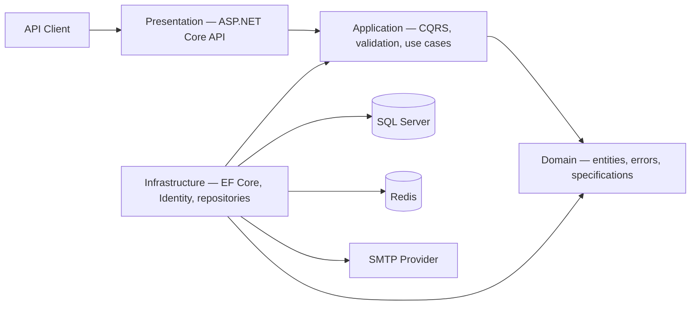
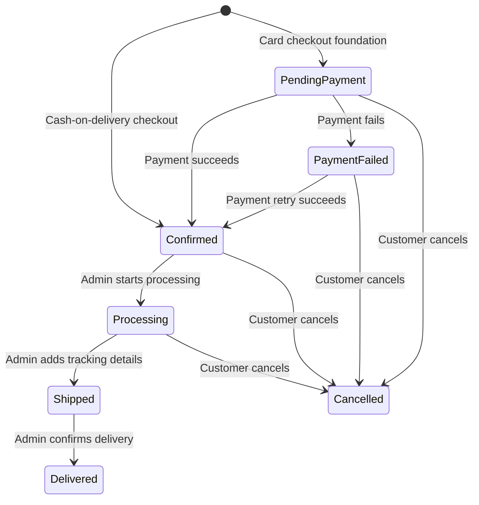

<div align="center">

# ECommerce API

### A production-minded e-commerce backend built with ASP.NET Core and Clean Architecture

[](https://dotnet.microsoft.com/)
[](https://www.microsoft.com/sql-server)
[](https://redis.io/)
[](https://www.docker.com/)

A RESTful API that covers the core workflows of a modern online store—from secure
authentication and catalog management to transactional checkout and order lifecycle
management.

[Features](#-key-features) • [Architecture](#-architecture) • [Tech Stack](#-tech-stack) • [Getting Started](#-getting-started) • [API Reference](#-api-reference)

</div>

---

## Overview

ECommerce API is a portfolio-ready backend project designed to demonstrate practical
backend engineering with modern .NET. The solution separates business rules from
framework and infrastructure concerns, uses CQRS to organize application workflows,
and runs as a complete local environment through Docker Compose.

The project focuses on maintainability, clear responsibilities, secure authentication,
consistent error responses, efficient querying, and an easy developer experience.

## ✨ Key Features

### Identity and security

- User registration, login, and email confirmation
- JWT access tokens with refresh-token rotation and revocation
- ASP.NET Core Identity integration
- Role-based authorization for administrative operations
- Configurable CORS policy and environment-based secrets

### Catalog management

- Category and product management
- Product image upload and persistent Docker storage
- Product activation/deactivation
- Pagination, filtering, searching, and dynamic sorting
- Specification Pattern for reusable query definitions

### Shopping experience

- User-specific shopping carts
- Add, update, remove, and clear cart items
- Address management
- Transactional order checkout with server-side price and product snapshots
- SQL-backed sequential order numbers and atomic stock updates
- Customer order cancellation with inventory restoration
- Admin order lifecycle management: processing, shipping, tracking, and delivery
- Cash-on-delivery payment collection when an order is delivered
- Order status history with customer ownership checks and admin access
- Product caching and cache invalidation with Redis

### API quality

- CQRS request handling with MediatR
- FluentValidation with a reusable validation pipeline
- RFC 7807-style Problem Details responses
- Centralized exception handling with request and trace identifiers
- Structured request and application logging with Serilog
- Interactive OpenAPI documentation powered by Scalar
- Automatic database migrations on Docker startup

### Reliability and performance

- Optimistic concurrency control with SQL Server `rowversion`
- Transaction boundaries around checkout and inventory-sensitive operations
- Projection-first read and update workflows to avoid loading unnecessary entities
- Partial updates for focused SQL `UPDATE` statements
- `AsNoTracking` read queries and paginated collection endpoints
- Role- and ownership-aware data access
- Product and address snapshots that preserve historical order accuracy

## 🏗 Architecture

The solution follows Clean Architecture and keeps dependencies pointing toward the
business core.



| Project | Responsibility |
|---|---|
| `ECommerce.Domain` | Enterprise entities, enums, domain errors, result and specification abstractions |
| `ECommerce.Application` | Use cases, CQRS commands/queries, contracts, validation, mapping, and interfaces |
| `ECommerce.Infrastructure` | EF Core, SQL Server, Identity, repositories, caching, email, files, and authentication |
| `ECommerce.Api` | HTTP endpoints, middleware, exception handling, OpenAPI, CORS, and composition root |

## 🧰 Tech Stack

| Area | Technologies |
|---|---|
| Runtime | .NET 10, ASP.NET Core Web API, C# |
| Data | Entity Framework Core, SQL Server 2022, LINQ |
| Caching | Redis, `IDistributedCache` |
| Security | ASP.NET Core Identity, JWT Bearer Authentication, role-based authorization |
| Architecture | Clean Architecture, CQRS, Repository, Unit of Work, Specification Pattern |
| Application | MediatR, FluentValidation, AutoMapper, Mapster |
| Observability | Serilog, request logging, trace-aware Problem Details |
| Documentation | OpenAPI, Scalar |
| Messaging | SMTP email delivery with MailKit |
| DevOps | Docker, Docker Compose, Linux containers, health checks, persistent volumes |

## 🧠 Engineering Highlights

This project goes beyond CRUD endpoints and explores problems that commonly appear in
real commerce systems:

- **Never trust client totals:** checkout retrieves current product data from the
  database and calculates order totals on the server.
- **Preserve historical truth:** order items store product name, SKU, and price
  snapshots, while orders store a shipping-address snapshot.
- **Protect inventory:** stock changes are performed atomically and cancellation
  restores quantities inside a transaction.
- **Handle concurrent updates:** orders, products, and payments use SQL Server
  `rowversion` tokens to detect stale writes.
- **Keep queries lean:** command handlers use explicit projections when only a small
  subset of columns is required, then apply focused partial updates.
- **Enforce state transitions:** domain methods prevent invalid changes such as
  delivering an order before it has been shipped.
- **Make operations traceable:** every important order transition is recorded in an
  order-status history.

## 📦 Order Lifecycle



Current checkout supports cash on delivery. The domain model and persistence layer
include the foundations for card payments, refunds, and idempotent payment webhooks.

## 📁 Project Structure

```text
ECommerce/
├── compose.yaml
├── .env.example
├── ECommerce.slnx
└── src/
    ├── ECommerce.Api/
    │   ├── Controllers/
    │   ├── Exceptions/
    │   ├── ViewModels/
    │   └── Dockerfile
    ├── ECommerce.Application/
    │   ├── Features/
    │   ├── Contracts/
    │   ├── Interfaces/
    │   └── Specifications/
    ├── ECommerce.Domain/
    │   ├── Entities/
    │   ├── Errors/
    │   └── Specifications/
    └── ECommerce.Infrastructure/
        ├── Identity/
        ├── Implementations/
        └── Persistence/
```

## 🚀 Getting Started

### Prerequisites

The recommended setup only requires:

- [Docker Desktop](https://www.docker.com/products/docker-desktop/)
- Git

For running without Docker, install the .NET 10 SDK, SQL Server, and Redis locally.

### Run with Docker

1. Clone the repository:

   ```bash
   git clone https://github.com/Muhammad-As3d/ECommerce.git
   cd ECommerce
   ```

2. Create your local environment file:

   ```powershell
   Copy-Item .env.example .env
   ```

   On macOS or Linux:

   ```bash
   cp .env.example .env
   ```

3. Replace the `change-me` values in `.env`. Use a strong SQL Server password and a
   JWT key with at least 32 random characters.

4. Build and start the full stack:

   ```bash
   docker compose up --build -d
   ```

5. Confirm that all containers are running:

   ```bash
   docker compose ps
   ```

The stack starts three services:

| Service | Default URL/Port |
|---|---|
| API | `http://localhost:8080` |
| SQL Server | `localhost:1433` |
| Redis | `localhost:6379` |

Database migrations are applied automatically when the API starts. SQL Server, Redis,
and uploaded product images use named volumes, so data survives container recreation.

### Useful Docker commands

```bash
# Follow API logs
docker compose logs -f api

# Stop the stack and preserve data
docker compose down

# Stop the stack and delete all local project data
docker compose down -v
```

> [!CAUTION]
> `docker compose down -v` permanently removes the local database, Redis data, and
> uploaded product images stored in Docker volumes.

## 📖 API Reference

With the application running in the Development environment, open the interactive
Scalar documentation:

**[http://localhost:8080/scalar](http://localhost:8080/scalar)**

### Main endpoint groups

| Resource | Capabilities |
|---|---|
| Authentication | Register, confirm email, resend confirmation, login, refresh, revoke refresh token |
| Categories | Browse, retrieve with products, create, update, toggle status |
| Products | Browse, retrieve, create, update, toggle status, upload/delete images |
| Cart | View cart, add/update/remove items, clear cart |
| Addresses | View, create, and delete user addresses |
| Orders | Checkout, personal/admin order queries, cancellation, lifecycle transitions, tracking, delivery, and status history |

### Order capabilities

| Actor | Capabilities |
|---|---|
| Customer | Checkout, list personal orders, view order details, cancel eligible orders, view status history |
| Admin | List all orders, start processing, mark as shipped with tracking information, mark as delivered, view any order history |

Order transitions are validated by domain rules. Shipping requires a `Processing`
order, delivery requires a `Shipped` order, and delivery marks cash-on-delivery
payments as successfully collected.

Protected endpoints require a JWT access token:

```http
Authorization: Bearer <access-token>
```

Administrative catalog operations additionally require the `Admin` role.

## ⚙️ Configuration

Docker Compose maps `.env` values to ASP.NET Core configuration using environment
variables. The local `.env` file is intentionally excluded from Git; only
`.env.example` should be committed.

| Variable | Purpose |
|---|---|
| `API_PORT` | API port exposed on the host |
| `SQL_DATABASE` | Application database name |
| `SQL_SA_PASSWORD` | SQL Server administrator password |
| `JWT_KEY` | Secret used to sign access tokens |
| `JWT_ISSUER` / `JWT_AUDIENCE` | JWT validation settings |
| `JWT_EXPIRY_MINUTES` | Access-token lifetime |
| `MAIL_*` | SMTP server and sender configuration |

> [!IMPORTANT]
> Never commit `.env`, production connection strings, SMTP credentials, or JWT keys.
> Use a dedicated secret manager in deployed environments.

## 🔄 Request Flow

1. A controller receives and maps the HTTP request.
2. MediatR dispatches a command or query to its application handler.
3. FluentValidation validates the request through the pipeline.
4. The handler coordinates domain logic through application interfaces.
5. Projection-based queries retrieve only the columns required by the use case.
6. Infrastructure implementations access SQL Server, Redis, files, or email services.
7. Transactions and concurrency tokens protect inventory and workflow updates.
8. The API returns a consistent success response or traceable Problem Details error.

## 🗺 Roadmap

- Stripe payment gateway and webhook integration
- Wishlist, reviews, and notifications endpoints
- Automated unit and integration test suites
- CI/CD pipeline and cloud deployment
- Metrics, distributed tracing, and production health endpoints

## 👨‍💻 Author

**Muhammad Asaad** — Backend .NET Developer

- [GitHub](https://github.com/Muhammad-As3d)
- [LinkedIn](https://linkedin.com/in/muhammad-as3d)
- [Email](mailto:muhammad.as3d@gmail.com)

---

<div align="center">
If you find this project useful, consider giving it a star. ⭐
</div>
